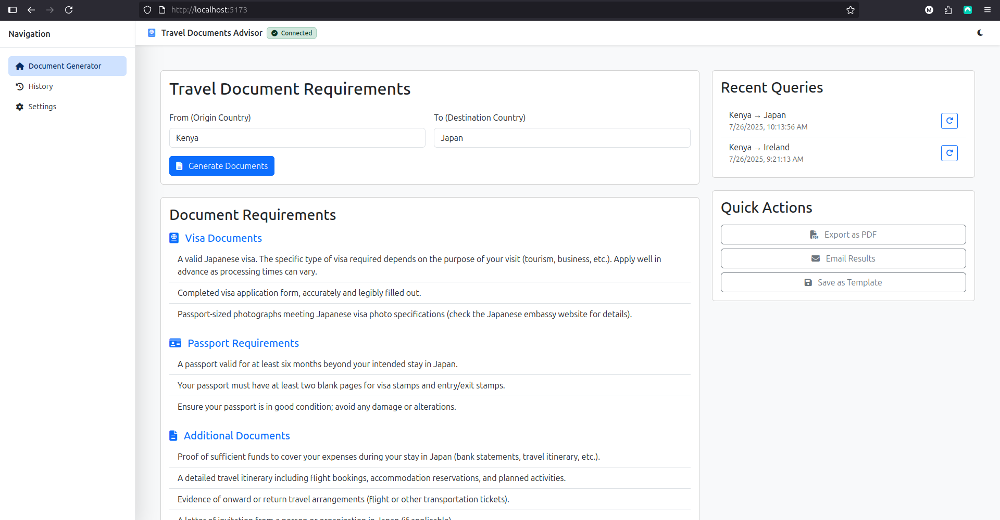
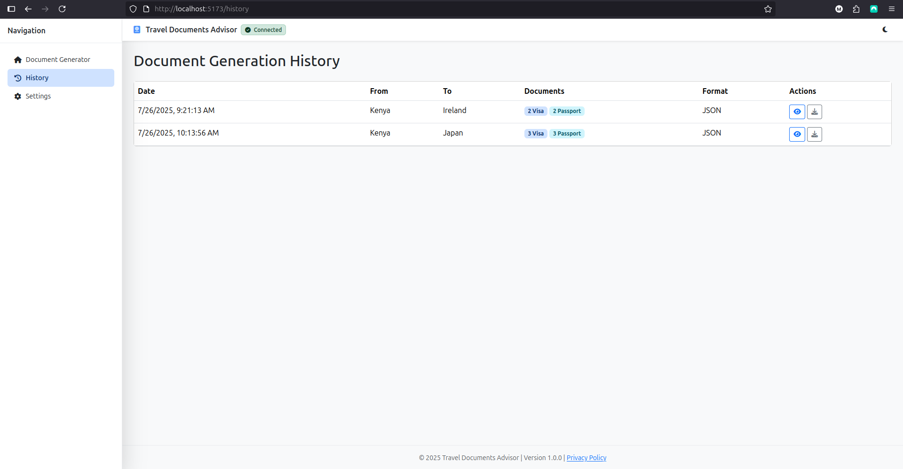
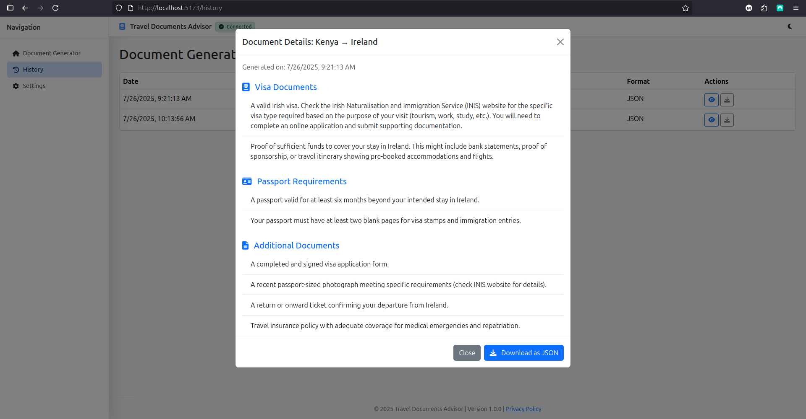
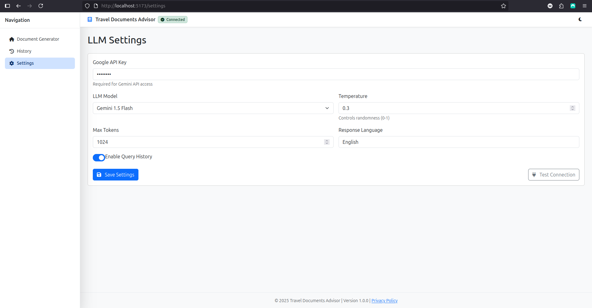
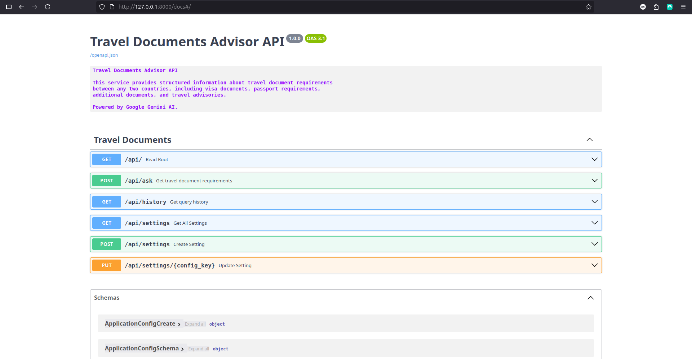
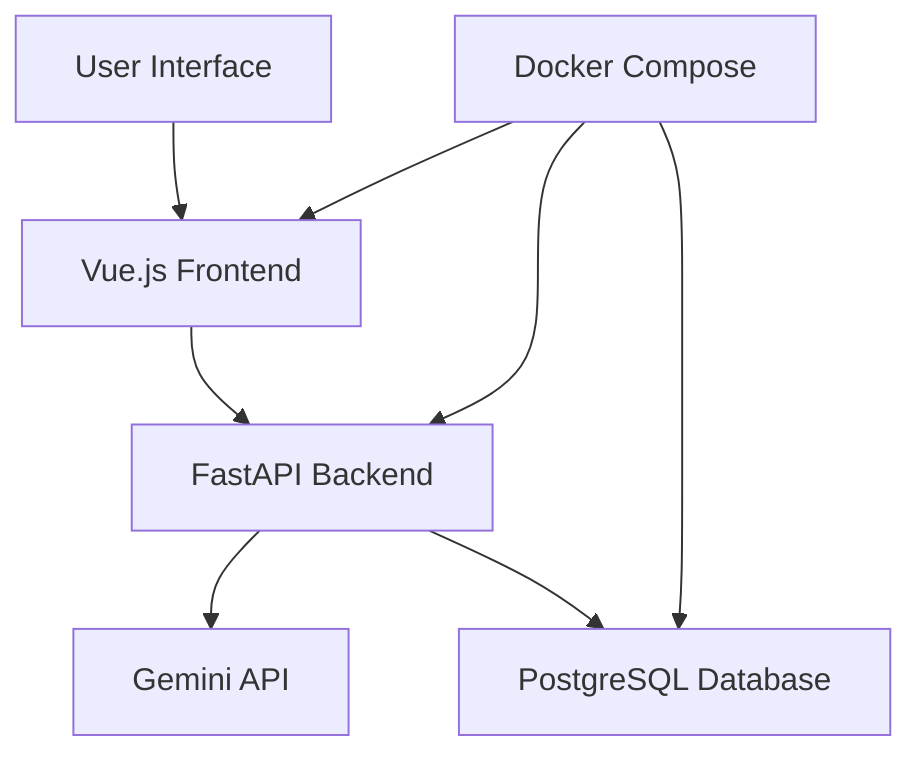

# Travel Documents Advisor

> An AI-powered travel documentation assistant that helps travelers determine required documents for international travel between any two countries.

[](https://opensource.org/licenses/MIT)
[](https://www.python.org/downloads/)
[](https://fastapi.tiangolo.com/)
[](https://vuejs.org/)

## 🌟 Overview

Travel Documents Advisor is a full-stack web application that leverages Large Language Models to provide comprehensive, up-to-date travel documentation requirements. Simply enter your origin and destination countries, and receive detailed information about visas, passport requirements, and essential travel documents.

### ✨ Key Benefits

- **Instant Results**: Get travel document requirements in seconds
- **Comprehensive Coverage**: Visa requirements, passport validity, and additional documents
- **AI-Powered**: Leverages Gemini's GPT models for accurate, current information
- **User-Friendly**: Clean, responsive interface works on all devices
- **Developer-Ready**: Full API documentation and containerized deployment

## 🚀 Features

### Core Functionality

- **Smart Document Analysis**: AI-powered evaluation of travel requirements
- **Country-to-Country Queries**: Support for any origin-destination combination
- **Structured Responses**: Organized results in easy-to-read categories
- **Travel Advisories**: Important warnings and recommendations

### Technical Features

- **REST API**: Well-documented endpoints with OpenAPI/Swagger
- **Real-time Processing**: Sub-second response times
- **Containerized**: Docker-ready for easy deployment
- **Database Integration**: PostgreSQL for optional query history
- **Modern Stack**: FastAPI + Vue.js with TailwindCSS

## Demo & Screenshots

> _Add your screenshots here to showcase the UI/UX of each page._

### Dashboard


_The interactive dashboard displaying generated travel document requirements for travel from Kenya to Japan, including visa documents, passport requirements, and travel advisories with a clean, organized presentation._

### DocHistoryView



_History page showing past document generation requests, with filtering and download actions._

### ModelSettingsView


_View for configuring your LLM (API key, model, temperature, max tokens) and testing connectivity._

### ApiDocsView


_Embedded Swagger/OpenAPI interface for exploring backend APIs._

---

## 🏗️ Architecture



## 🛠️ Tech Stack

### Backend

- **FastAPI** - High-performance Python web framework
- **Gemini API** - GPT-3.5-turbo for intelligent responses
- **PostgreSQL** - Reliable data storage
- **SQLAlchemy** - Database ORM
- **Pydantic** - Data validation and serialization

### Frontend

- **Vue.js 3** - Progressive JavaScript framework
- **TailwindCSS** - Utility-first CSS framework
- **Vite** - Fast build tool and dev server
- **Axios** - HTTP client for API communication

### DevOps

- **Docker & Docker Compose** - Containerization
- **Alembic** - Database migrations
- **Swagger/OpenAPI** - API documentation

## 🚦 Quick Start

### Prerequisites

Ensure you have the following installed:

- [Docker](https://docs.docker.com/get-docker/) & [Docker Compose](https://docs.docker.com/compose/install/)
- [Git](https://git-scm.com/downloads)

### 1. Clone the Repository

```bash
git clone https://github.com/eddgachi/travel-docs-llm.git
cd travel-docs-llm
```

### 2. Configure Environment

```bash
# Copy the environment template
cp backend/.env.template backend/.env

# Edit the .env file with your configuration
nano backend/.env
```

Required environment variables:

```env
GEMINI_API_KEY=your_gemini_api_key_here
POSTGRES_USER=travel_user
POSTGRES_PASSWORD=secure_password
POSTGRES_DB=travel_docs
POSTGRES_HOST=postgres
POSTGRES_PORT=5432
```

### 3. Launch the Application

```bash
# Build and start all services
docker-compose up --build

# Or run in detached mode
docker-compose up -d --build
```

### 4. Access the Application

- **Frontend**: http://localhost:5173
- **API**: http://localhost:8000
- **API Documentation**: http://localhost:8000/docs

## 📂 Project Structure

```
travel-docs-llm/
├── 📁 backend/
│   ├── 📁 app/
│   │   ├── 📄 main.py              # FastAPI application entry point
│   │   ├── 📄 routes.py            # API route definitions
│   │   ├── 📄 schemas.py           # Pydantic data models
│   │   ├── 📄 services.py          # Business logic & LLM integration
│   │   └── 📄 database.py          # Database connection & models
│   ├── 📁 alembic/                 # Database migrations
│   ├── 📄 Dockerfile
│   ├── 📄 requirements.txt
│   └── 📄 .env.template
├── 📁 frontend/
│   ├── 📁 src/
│   │   ├── 📁 components/          # Vue components
│   │   ├── 📁 views/               # Page components
│   │   ├── 📁 services/            # API service layer
│   │   └── 📄 main.js              # Application entry point
│   ├── 📄 Dockerfile
│   ├── 📄 package.json
│   └── 📄 vite.config.js
├── 📄 docker-compose.yml
├── 📄 README.md
└── 📄 LICENSE
```

## 🔧 API Reference

### Endpoints

#### POST `/api/ask`

Query travel document requirements between two countries.

**Request Body:**

```json
{
  "origin": "Kenya",
  "destination": "Ireland",
  "travel_purpose": "tourism",
  "duration": "2 weeks"
}
```

**Response:**

```json
{
  "status": "success",
  "data": {
    "visa_documents": [
      "Valid passport with at least 6 months validity",
      "Completed visa application form",
      "Recent passport photographs"
    ],
    "passport_requirements": [
      "Passport must be valid for at least 6 months from entry date",
      "At least 2 blank pages required"
    ],
    "additional_documents": ["Proof of accommodation", "Return flight tickets", "Bank statements (last 3 months)"],
    "advisories": ["No special health requirements", "Check latest COVID-19 regulations"]
  },
  "timestamp": "2024-01-15T10:30:00Z"
}
```

#### GET `/health`

Health check endpoint for monitoring.

**Response:**

```json
{
  "status": "healthy",
  "timestamp": "2024-01-15T10:30:00Z"
}
```

## 🧪 Development

### Local Development Setup

If you prefer to run services individually:

#### Backend

```bash
cd backend
python -m venv venv
source venv/bin/activate  # On Windows: venv\Scripts\activate
pip install -r requirements.txt
uvicorn app.main:app --reload --host 0.0.0.0 --port 8000
```

#### Frontend

```bash
cd frontend
npm install
npm run dev
```

### Running Tests

```bash
# Backend tests
cd backend
pytest

# Frontend tests
cd frontend
npm run test
```

### Database Migrations

```bash
# Generate new migration
alembic revision --autogenerate -m "Description of changes"

# Apply migrations
alembic upgrade head
```

## 🚀 Deployment

### Production Deployment

1. **Set Production Environment Variables**

   ```bash
   export ENVIRONMENT=production
   export GEMINI_API_KEY=your_production_key
   # ... other production variables
   ```

2. **Deploy with Docker Compose**
   ```bash
   docker-compose -f docker-compose.prod.yml up -d
   ```

### Cloud Deployment Options

- **AWS**: Use ECS or EKS with RDS for PostgreSQL
- **Google Cloud**: Deploy on Cloud Run with Cloud SQL
- **Azure**: Use Container Instances with Azure Database
- **Heroku**: Simple deployment with Heroku Postgres

## 🤝 Contributing

We welcome contributions! Please follow these steps:

1. **Fork the repository**
2. **Create a feature branch**
   ```bash
   git checkout -b feature/amazing-feature
   ```
3. **Make your changes**
4. **Add tests** for new functionality
5. **Commit your changes**
   ```bash
   git commit -m "feat: add amazing feature"
   ```
6. **Push to your branch**
   ```bash
   git push origin feature/amazing-feature
   ```
7. **Open a Pull Request**

### Development Guidelines

- Follow PEP 8 for Python code
- Use conventional commits for commit messages
- Add tests for new features
- Update documentation as needed
- Ensure all tests pass before submitting PR

## 📝 License

This project is licensed under the MIT License - see the [LICENSE](LICENSE) file for details.

## 🆘 Support

- **Documentation**: Check our [API docs](http://localhost:8000/docs) when running locally
- **Issues**: Report bugs or request features via [GitHub Issues](https://github.com/eddgachi/travel-docs-llm/issues)
- **Discussions**: Join our [GitHub Discussions](https://github.com/eddgachi/travel-docs-llm/discussions)

## 🔮 Roadmap

- [ ] Multi-language support
- [ ] Real-time embassy data integration
- [ ] Mobile app development
- [ ] Offline mode capabilities
- [ ] Travel itinerary planning
- [ ] Document reminder notifications

---

<div align="center">

**Made with ❤️ by [Edd Gachira](https://github.com/eddgachi)**

[⭐ Star this repo](https://github.com/eddgachi/travel-docs-llm) if you found it helpful!

</div>
